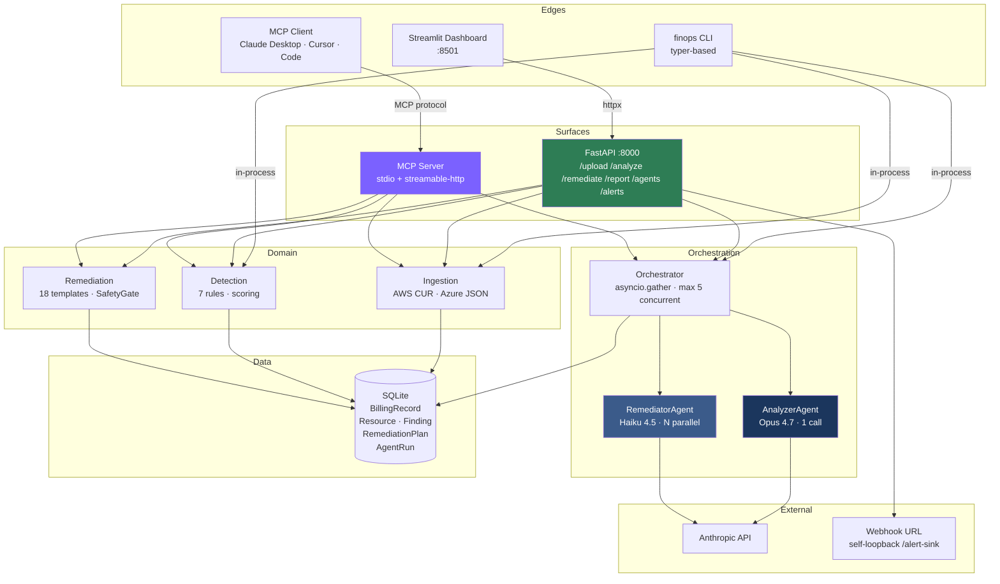
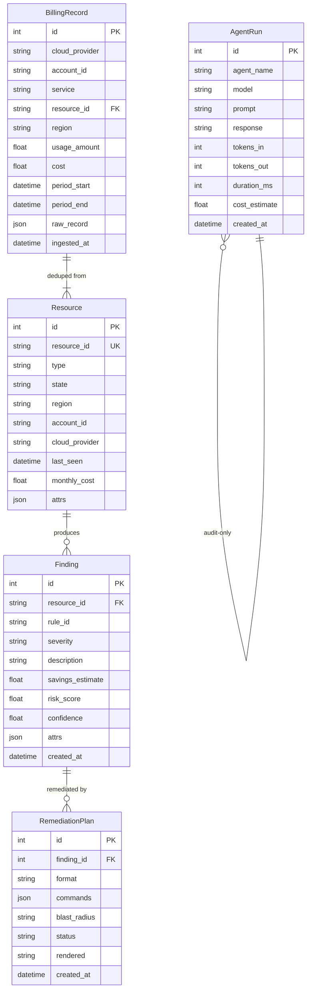
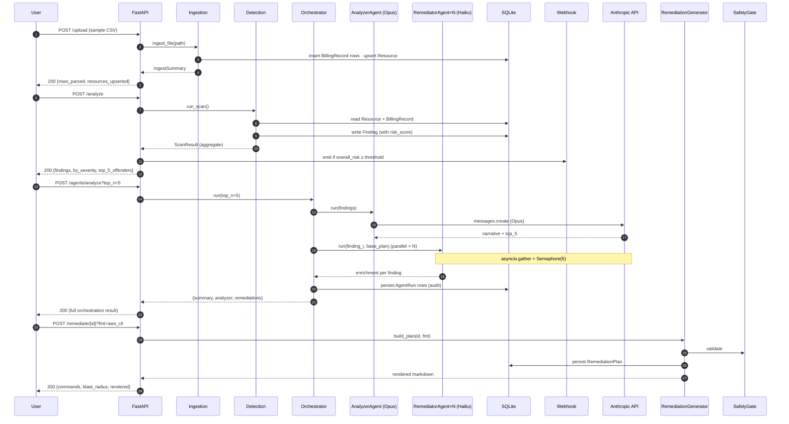
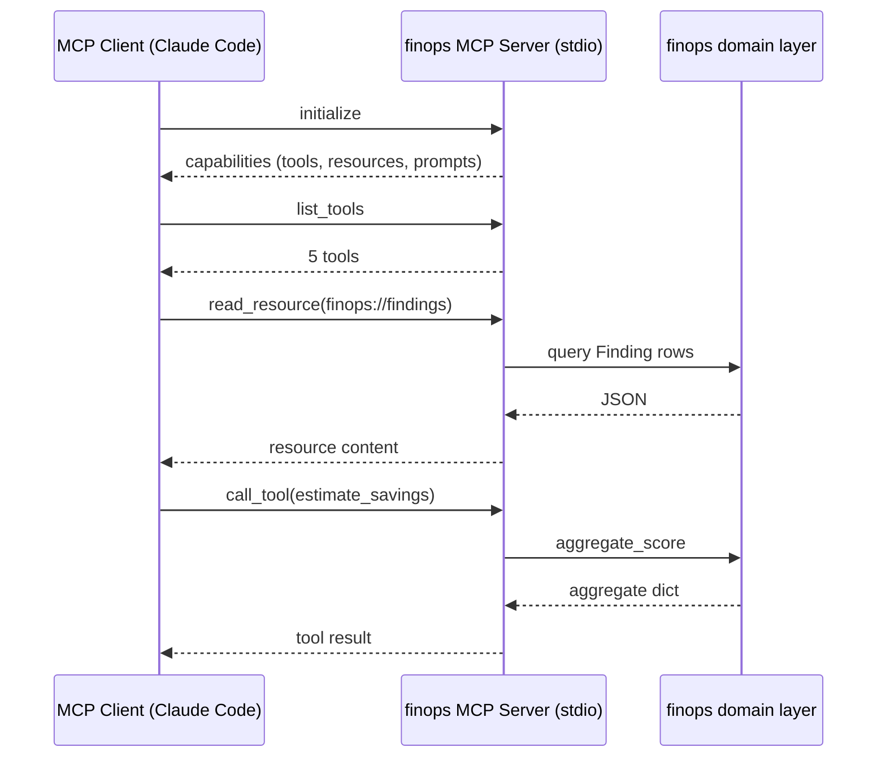

# Architecture

This project is a layered Python application: data → domain → orchestration → edge. Every layer can be replaced independently because boundaries are explicit and the interfaces narrow.

## High-level diagram

## Layered modules

| Layer | Module | Responsibility | Boundary |
|---|---|---|---|
| **Edge** | `finops.api` | REST surface (FastAPI), request validation, response shaping | HTTP |
| | `finops.dashboard` | Streamlit UI; talks to API only (ADR-015) | HTTPS |
| | `finops.mcp_server` | MCP tools/resources/prompts | stdio · streamable-http |
| **Orchestration** | `finops.agents` | Sub-agent dispatch + audit (Opus + Haiku + reviewer) | Anthropic SDK |
| **Domain** | `finops.detection` | Rules engine, risk scoring | DB-only |
| | `finops.remediation` | Plan generation, SafetyGate | DB-only |
| **Data** | `finops.db` | Models (SQLModel), session lifecycle | DB |
| | `finops.ingestion` | AWS CUR + Azure parsers | Filesystem in / DB out |
| **Cross-cutting** | `finops.config` | Settings (pydantic-settings), `.env`-loaded | Process env |
| | `finops.utils` | Demo runner, status renderer | n/a |

## Data model

## Sequence — `/audit` end-to-end

## Sequence — MCP client interaction

## Why this architecture

- **API-first** because the doc requires it, and because it's the only sane way to support multiple frontends (Streamlit, MCP, future React).
- **Layer separation** so the data layer can move from SQLite to Postgres without touching detection or agents.
- **Sub-agents over single-prompt** because (a) cost — 1 Opus call beats N Opus calls; (b) parallelism — `asyncio.gather` over Haiku workers; (c) failure isolation — one bad finding fails one Haiku, others continue. ADR-002, ADR-013.
- **MCP alongside REST** because the targets are different — humans/dashboards vs AI clients. Same engine, two doors. ADR-014.
- **Deterministic fallback** so the demo never depends on a working API key. ADR-007.

## Failure isolation

| Failure | What happens | Recovery |
|---|---|---|
| Anthropic API key invalid | Sub-agents use deterministic fallback path. Output shape identical. | Provide a valid key; system flips automatically (no code change). |
| One Haiku call crashes mid-orchestration | `asyncio.gather` resolves the survivors; result includes only successful enrichments. | None needed — Analyzer narrative still produced. |
| Detection rule throws | Caught at `DetectionEngine.scan` level; that rule's findings missing for one resource. | Fix and re-scan. Other rules unaffected. |
| Webhook URL unreachable | `WebhookEmitter.send` retries 3× with exponential backoff, returns `{sent: false, error: ...}`. Analyze response unaffected. | Update `WEBHOOK_URL`. |
| Bad CSV row | Parser counts in `summary.skipped`, records line number in `summary.errors`, continues. | Inspect errors; fix source data. |

## Performance characteristics

Measured on the bundled 17-resource / 228-line sample (Apple Silicon, Python 3.11.14):

| Operation | Wall-clock |
|---|---|
| Ingest (sample CUR) | ~0.05s |
| Scan (7 rules × 17 resources) | ~0.05s |
| Generate one remediation plan | ~0.01s |
| Orchestrate fallback (3 enrichments) | ~0.05s |
| Orchestrate LLM (1 Opus + 3 Haiku parallel) | ~25s |
| Full demo (`make demo`) in fallback | ~0.3s |
| Test suite (150 tests) | ~5s |

Cost (LLM): **~$0.15 per audit** at the Opus-orchestrator + Haiku-workers topology. ROI > 140× on the bundled sample.

## File map

See [`docs/AGENTIC_SURFACE.md`](./AGENTIC_SURFACE.md) for the `.claude/` agentic surface — that's part of the architecture, not a side concern.
